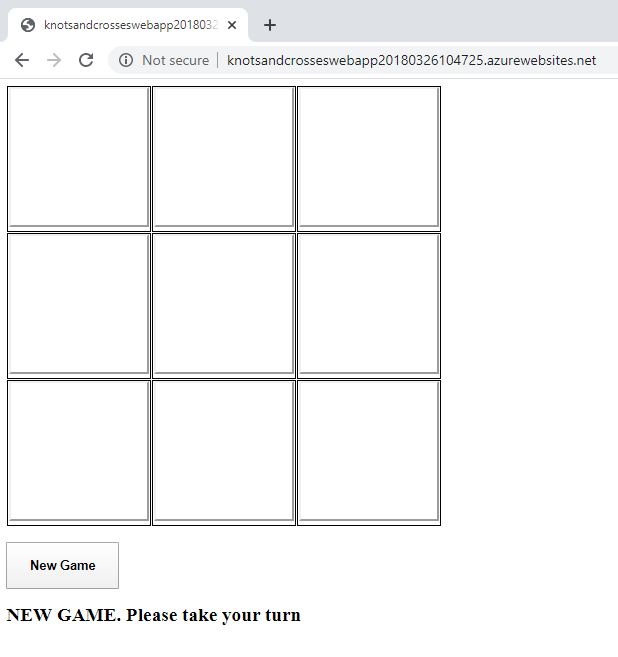
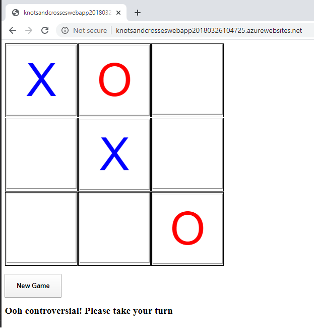
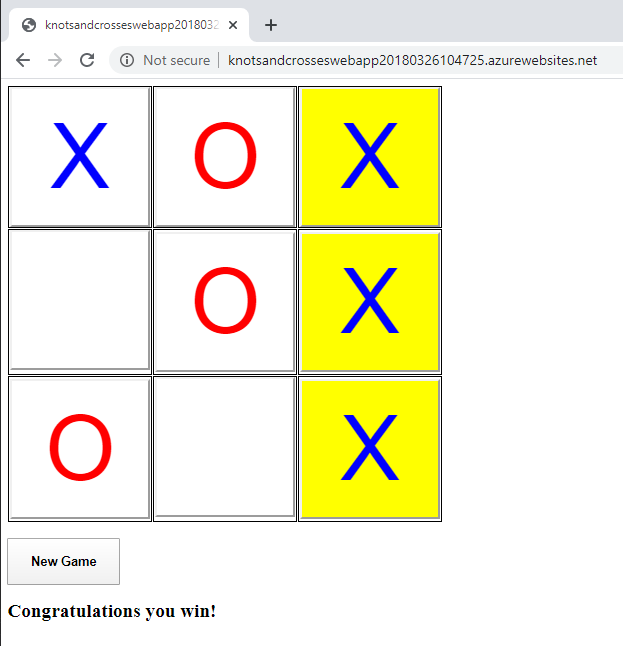
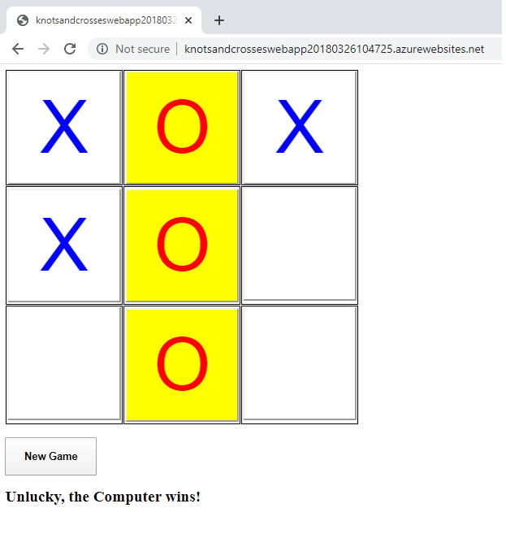

# Knots and Crosses (tic-tac-toe) Web App
Simple knots and crosses (tic-tac-toe) web app where you can play against a "semi-intelligent" computer player.  Web app developed 4 ways - WebForms, Blazor (WASM/Server) and  .NET MAUI Blazor.

* User plays knots and crosses (tic-tac-toe) against a "semi-intelligent" computer player 
* Computer player will try to win the game and stop the user from winning the game
* Can repeatedly play new games
* Random in-play message displayed after each user turn
* Four versions of front end developed which are 
  - Blazor WebAssembly with PWA/.Net 6
  - Blazor Server/.Net 6
  - ASP.Net Web Forms 4.8
  - Blazor MAUI/.Net 6
* Game engine is developed using .Net Standard 2
* Live web app (Blazor WebAssembly with PWA version) is deployed to an Azure web app

## New Game

## In Play

## Player Wins

## Computer Wins

